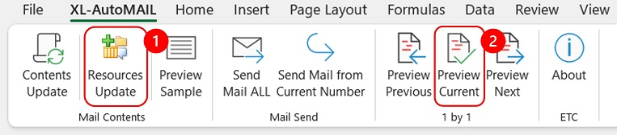

# XL-AutoMAIL - 엑셀 오토메일

> 🎯 **XL-AutoMAIL V.1.0.1**  
> Excel 기반 Outlook 자동 메일 발송 도구  
> 수신자별 메일 제목 · 본문 · 첨부파일을 자동 구성하고, 클릭 한 번으로 대량 발송까지 처리할 수 있습니다.
>  
> 🔧 주요 기능
> - 수신자별 맞춤 메일 템플릿 작성  
> - 첨부파일 · 이미지 자동 삽입
> - Outlook 서명 적용, 예약 발송 가능
> - 개별 발송 or 전체 발송 모두 지원

※ PC에 Microsoft Outlook이 설치되어 있어야 합니다.

***
## 프로그램 다운로드
[XL-AutoMAIL_V1.0.1.zip 다운로드](https://github.com/vveekzero/AutoHR/raw/refs/heads/main/XL-AutoMail/Files/XLAutoMAIL_V1.0.1_.zip)

※ zip 압축 파일입니다. 반드시 압축을 풀고 사용하세요.(샘플 메일을 위한 샘플 이미지 및 첨부파일이 포함되어 있습니다.)
- zip 파일에는 샘플 메일을 위한 샘플 이미지 및 첨부파일이 포함되어 있습니다.
- 샘플 메일을 사용해보기 전에 반드시 **Resources Update**버튼을 사용하여 첨부 파일 경로를 업데이트 해주세요!

## 프로그램 사용법

### 1) 매크로 기능 사용

※ 주의: 파일이 열릴 때 다음과 같은 오류가 표시되면 다음 순서대로 조치하면 됩니다.

 
파일이 열릴 때 제한된 보기라고 나오면  <편집사용> 버튼을 클릭합니다.

 
매크로 사용과 관련된 보안경고가 나오면 <콘텐츠 사용>을 누릅니다.

 
만약, 매크로 사용 버튼이 표시되지 않거나 다음과 같은 경고가 표시되면

 
파일 속성(마우스로 파일선택→마우스 우클릭→메뉴에서 속성 선택)에서 "차단 해제"를 해 주어야 합니다.

 

### 2) mContents(메일내용) 시트 입력
 
Mail Option 에서는 메일의 설정을 변경할 수 있습니다.

- Request a Delivery Request : "YES"를 선택하면 메일이 성공적으로 배송되었을 때, 배송 완료 안내 메일이 수신됩니다.
- Request a Read Receipt : "YES"를 선택하면, 수신자가 메일을 읽었는지에 대한 확인 메일을 받을 수 있습니다.  
단, 수신자가 메일을 열 때 표시되는 '읽음 확인 메일을 보낼까요?'라는 팝업에서 *"예"를 선택한 경우에만 확인 메일이 발송됩니다.
- Use Signature : "YES"를 선택하면 Outlook에 설정한 서명을 사용합니다.(단, 서명기능을 사용하려면 *반드시 Outlook을 먼저 실행해야 합니다.)
- Use HTML : 메일 본문에 다양한 스타일을 적용하거나 이미지를 첨부하기 위해 필요한 옵션입니다. 반드시 "YES"로 설정하세요.
- Mail body font size and type : 메일 본문 전체에 적용할 폰트 크기를 설정할 수 있습니다.
- Delaty Delivery Do not delivery before : 배달 원하는 시간을 "2021-05-06 23:30"의 형태로 입력할 수 있습니다.(예약발송기능)  
보내는 메일마다 배달지연시간을 달리하려면 mList시트에 시간을 입력하고 여기에는 대체할 번호를 입력한다( 예: {8} )
- Send on Behalrf of Another Person :
 
 
 
 
Mail Body Table 에서는 메일 내용을 입력할 수 있습니다.

- Subject : 메일 제목을 입력하는 칸입니다.
- Body## : 메일 본문을 줄단위로 입력할 수 있습니다.
- Font Size : Font Size 항목에 값을 입력하면, 해당 줄에 입력한 글꼴 크기가 적용됩니다.(미 입력시 기본 폰트사이즈 적용)
- Color1 & Color 2 : 해당 칸에 적용할 색상을 셀 채우기로 지정한 후, 본문에서 색상을 적용하고 싶은 부분을 &lt;C1&gt;...&lt;/C1&gt; 형식으로 감싸면 해당 색상이 적용됩니다.
- Contents : 메일 본문을 입력하는 칸입니다. HTML을 사용하여 다양한 스타일을 적용할 수 있습니다.

**※ 항목 중 수신자별로 변경이 필요한 부분은 {4}와 같은 형식으로 작성하면, 해당 값은 mList에 입력된 내용으로 자동 대체됩니다.**  
**※ XLAutoMAIL 파일의 Styling code와 기본 입력된 샘플 컨텐츠를 참고해 주세요.**

 

 
메일 내용의 작성 및 수정이 완료된 후 반드시 **Contents Update** 버튼을 눌러야 합니다.

 

 
Previw Sample 버튼을 통해 메일의 Sample을 프리뷰 할 수 있습니다.

 

### 3) mResources(첨부파일) 시트 입력
 
Resources Update 버튼을 누르면 mResources 시트에 파일리스트가 업데이트 됩니다.

- Attachment 폴더와 Image Folder에 넣은 파일의 이름과 파일경로가 표시됩니다.
- 메일 본문에 첨부할 이미지나 첨부할 파일의 경로를 mList 시트에 넣어서 사용할 수 있습니다.  

 

### 4) mList(발송리스트) 시트 입력
mList 시트에서는 메일 수신자와 수신자 별로 변경이 필요한 내용, 첨부이미지, 첨부파일 등을 입력할 수 있습니다.

- No. : 수신자번호
- Whether to send (YES or NO) : 메일 자동발송 여부 YES or NO
- Recipient Mail (TO) {1} : 발신자 메일주소
- Carbon Copy (CC) {2} : CC 메일주소
- Blind Carbon Copy (BCC) {3} : BCC 메일주소
- Value to replace {4} - {25} : 대체할 내용
 

 - image {26} - {45} : 메일본문에 첨부할 이미지파일 주소
 

 - File name of Attachment 1 - 20 : 메일에 첨부할 파일 주소
 

### 5) XLAutoMAIL 메일보내기

각 시트에 모든 내용 입력이 완료되었으면 XLAutoMAIL 리본메뉴를 통해 Outlook으로 메일을 자동으로 발송합니다.
메일 컨텐츠 작성이 완료되었다면 **Contents Update**를 눌러야 Outlook에 적용됩니다.

#### Mail Send 메뉴
대상자 전체에게 자동메일 보내기
- Send Mail ALL : mList에 보내기로 체크한(YES) 모든 사람에게 메일을 발송합니다.
- Send Mail from Current Number : mList에 보내기로 체크한(YES) 사람 중 현재 수신자 번호부터 끝까지 메일을 발송합니다.

#### 1 by 1 메뉴
대상자 한사람씩 메일내용을 리뷰하고 개별발송하기

 
mContents시트에서 스핀버튼을 통해 현재 대상자 번호를 변경할 수 있습니다.
중요 메일은 대상자별로 내용을 리뷰한 후 개별 발송할 수 있습니다.

- 현재 수신자 번호 이전 대상자의 메일을 미리보기합니다.
- 현재 수신자 번호 대상자의 메일을 미리보기합니다.
- 현재 수신자 번호 다음 대상자의 메일을 미리보기합니다.

## 프로그램 사용 예시

 
📌 기본 파일에는 샘플 메일 예제가 포함되어 있습니다.  
먼저 **Resources Update** 버튼으로 첨부파일 경로를 갱신한 후, **Preview Current** 버튼을 눌러 샘플 메일을 확인해보세요.

 
**Preview Current** 실행 시 아웃룩 화면
